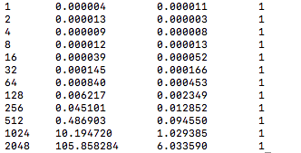

# Strassen Multiplication

## Compilation
gcc -O3 -o strassen_test *.c
./strassen_test

The file **strassen.c** contains the optimised version of Strassen Multiplication. From the result, we can see that this version takes less time than the non-optimised version.

