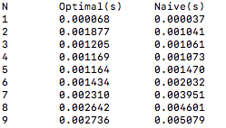

# Chain Matrix Multiplication

## Compilation
- make
- ./chain_test.x

The file **matrix_chain.c** contains the Chain Matrix Multiplication. From the result, we can see that the chain matrix multiplication takes less time than the naive matrix multiplication.

