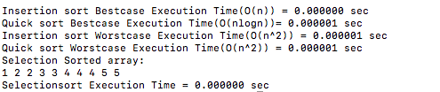

# Strassen Multiplication

## Compilation
- gcc -O3 -o sorting_test *.c
- ./sorting_test

The file **sorting.c** contains all the sorting algorithms. From the result, we can see that worst and best cases of **Insertion and Quick sort** along with the generalised **Selection sort algorithm** for an array with repeated elements.

